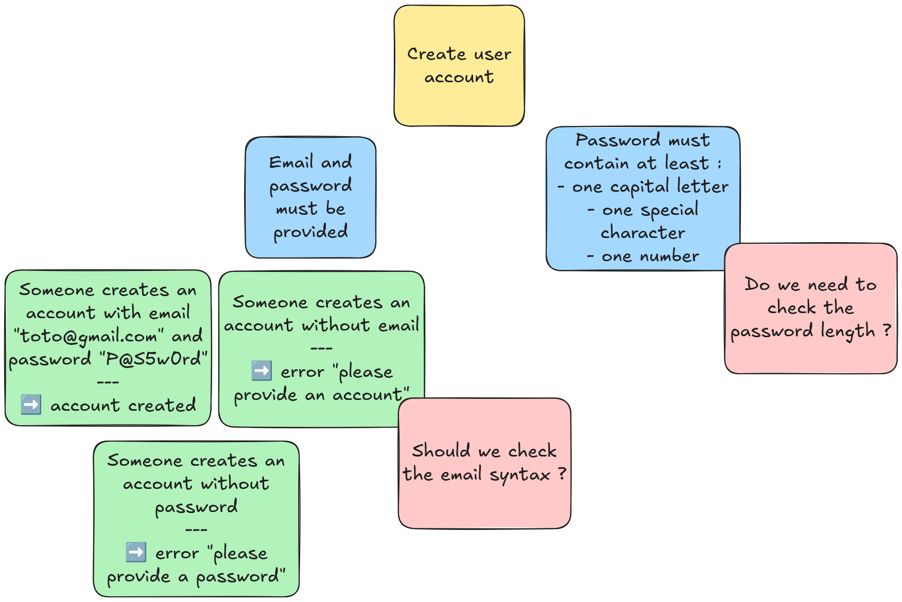

<!-- .slide: data-background-image="./peter-pryharski-8zJSg57TBBA-unsplash.jpg" -->

# Le test, grand oublié de l'Agilité ?

---

## Merci aux sponsors

TODO sponsors Agile Grenoble

Notes:
* TODO sponsors Agile Genève

-v-

## Présentation

Julien Lenormand

Eric Papazian

Notes:
* notre carrière commune en ESN
* prestation
* industrie

---

<!-- .slide: data-background-image="./jerry-kavan-vv-oEGlN-4E-unsplash.jpg" -->

# Introduction : objectifs

---

<!--
# Plan

* qui on est
* de quoi qu'on parle, c'est quoi le problème : on s'est rencontré j'étais dev et lui QA
* nos expériences et nos leçons (en vrac, à voir l'ordre ensuite) #top10
  * thales acp : dev en faux-agile, qa en cycle en V, prise en compte du débrayage pour permettre le spy de test : coût marginal pour gain absolu
  * schneider : archi de robot2jira pour intégrer un rapport du pipeline, testable design
  * schneider : procès
  * sncf : test de canva image très très difficile (données non maitrisées), avoir une API pour récupérer ses infos, qui est testée au niveau composant
    * quid de l'example mapping ?
  * schneider proac : heureusement y'a des tests e2e, mais il manque de tests unitaires/integ, donc l'itération est très lente, cf pyramide pas respectée, et boucle de feedback niveau produit cassée par la nightly, et boucle système cassée par release
  * initiative avec Eloise : avoir les moyens en temps, 2 ans plus tard ça s'est perdu
  * quels KPIs on peut proposer ? pas trop de flaky
  * ACCELERATE : opposition vitesse de dev versus stabilité d'ops, les métriques qui s'éuilibrent (et contre la loi de Goodhart)
  * automatisation de test requise pour pouvoir itérer vite, sinon phases de QA trop lentes
  * 10 idées 
  * transformation du rôle de QA dans les équipes Agile (Scrum)
  * turnover et onboarding, garde-fou, apprentissage du métier (voire redécouverte)
  * disposer d'un rapport de maintenance pour le debug, mais aussi pour les tests (shift right), flux du feeback des bugs inverse à celui des features
  * scrum is not enough
  * exemple du besoin de faire tester par des utilisateurs (game jam, ...) cf halway usability test
  * "tests that we dont have time to do"
  * rôle et importance du QA
  * première tache d'onboarding = faire un test, le faire passer en CI (ou la doc d'onboarding)
  * pair testing
-->

<!-- .slide: data-background-image="./daniel-macura-uzDKKDK-A1E-unsplash.jpg" -->

# 1. Code testable et architecture testable

-v-

## Permettre la testabilité

Notes:
* JULIEN: Eric et moi nous sommes rencontré sur une mission il y a 3 ans, un projet de micro-services, moi côté dev, lui côté IVVQ (Valid/Verif/QA). On était sur du bon vieux silo : dans mon équipe on essayait de développer des trucs, on lui livrait le bousin, et eux devaient se débrouiller pour réussir à les configurer, lancer, instrumenter, et finalement tester. Si l'on ne prenait en compte que nos spécifications (fonctionnelles), on devait lui livrer quelque chose de sécurisé, sur lequel on ne peut pas se brancher, donc pas vraiment moyen de tester.
  * TODO ERIC: Julien a plus en tête les détails du spy, c'était une histoire de MITM ?
* JULIEN: Mais je voyais bien que ce qu'on allait leur livrer serait difficile voire impossible à tester (on avait déjà du mal nous). Je suis donc allé voir Eric, que je ne connaissais pas encore, et on a parlé. Que pouvais-je prendre en compte dans ma conception et mon implémentation pour lui faciliter la vie ?
* JULIEN: Là j'ai du aller parler à un autre être humain pour faire de meilleurs choix, mais souvent c'est avec notre nous du futur qu'il faut discuter des besoins de test, et prévoir dès aujourd'hui le code pour.
  * TODO JULIEN: intégrer Eric à ce discours

-v-

## Ou bien ne pas pouvoir tester

Notes:
* JULIEN : là c'était un exemple de quand ça se passe bien, parce qu'on a pu discuter, prendre en compte les besoins. Quand ça ne l'est pas, on se retrouve parfois au pied du mur. J'ai été sur une mission d'automatisation de test, bien après que l'application ait été developpée. Il y avait des cas de test prévus pour des humains, et qui consistaient à cliquer sur des zones interactives d'une image (un canva). Autant c'était simple humainement de le faire, autant écrire un script équivalent s'est montré bien trop compliqué. Il aurait fallu ajouter des ids de test, des métadonnées, ou un bypass, ... peu importe, mais une façon qui permettait de ne pas avoir à développer un modèle de vision customisé.

-v-

## La testabilité est une feature

Notes:
* JULIEN: sur une autre mission, j'avais initié une refonte d'une petite application, dont le but principal était de lire et écrire sur une API tierce (qu'on ne controle pas, et qui est lent et peu fiable). Beaucoup de side-effects. Pour faciliter la testabilité, j'aurais pu découpler mon pipeline des interactions avec le serveur. Mais j'aurais été obligé de développer un fake, ce qui aurait posé d'autres problèmes. J'ai donc adapté ma conception : l'intention et le résultat de chaque interaction avec le serveur était consigné dans un journal, qui permettait lors des tests d'identifier efficacement ce qui s'était passé, et ce qui n'était pas normal. Et ça aidait énormément pour dépanner les erreurs en prod ensuite. J'ai pris en compte la testabilité dans le design, ce qui a ouvert la voie à des features différentes.

-v-

## Quelques notions

Notes:
* JULIEN: si vous voulez creuser un peu, je vous invite à regarder la notion de TestOps (l'équivalent du DevOps pour le testing), ou la notion de "seams" de Michael Feathers dans Testing Legacy Software (identifier/créer des coutures/lignes de faille dans nos architectures).

---

# TODO: 2. outils adaptés : tooling et hardware (devices, RAM)

Notes:
* ERIC
  * faire une slide avec images matériels etc
  * le DUT / du matériel -> les bornes, tests systèmes, des simus (hardware ou soft)
  * un outil de gestion -> Jira (?)
  * des moyens d'automatisation -> boardfarm, CI
  * un framework de test -> RobotFramework (?)
* JULIEN: Thales

---

# TODO: 3. test fiable : fiabilité et maintenabilité des tests

Notes:
* ERIC: 
  * faire une slide avec rf historic + graphes de tests qui passent qui fluctue
  * raconter anecdote tests à schneider
  * mettre des efforts pour la maintenance afin d'avoir peu de tests qui échouent pour permettre l'analyse rapide de la non régression
  * historisation de la visu des tests (cc Pinjon) pour trouver les flaky
* JULIEN: ACP : test de micro-services ("le système démarre")

---

<!-- .slide: data-background-image="./Everything-Everywhere-All-at-Once-film-still.png" -->

# 4. Tests everything, everywhere, all at once

-v-

## Le test est un besoin

Notes:
* JULIEN: C'est quand à la toute fin qu'on veut écrire des tests, qu'on se rend compte que ce n'est pas si simple en fait ... Ah, si seulement on y avait pensé plus tôt ! Justement : le test est un besoin au niveau projet. Certes, pas un besoin utilisateur, mais un pré-requis pour pouvoir amener des solutions aux besoins clients.
* TODO JULIEN: remettre une couche de TestOps ici ? (évoqué comme "à creuser" dans la partie 1)

-v-

## Tres amigos

Notes:
* Julien: est-ce que vous connaissez les "tres amigos" ? PO, Dev et QA. Autrement dit : besoin client, solution technique, regard qualité et critique sur l'adéquation entre les deux. Car les QA/testeurs/... sont idalement placés à cheval entre les deux mondes, et avec un regard critique sur chacun, pour apporter une vision éclairée sur les discussions.
* JULIEN: je parle d'expérience, même en ayant une sensibilité test et QA pas commune chez les devs, je reste un dev. Quand on me parle problème, j'ai souvent comme premier réflexe de foncer côté solution. Alors qu'un QA n'aura pas ce biais (et même au contraire voudrait bien avoir moins de code à tester !). Dans une mission, autant que possible on embarquait la personne QA de l'équipe, car elle amenait toujours un regard différent de celui PO/BA et Dev. Et les QA sont très bons pour penser en amont aux cas tordus, aux interactions imprévues entre les features, ...

-v-

## Example Mapping

  <!-- .element: class="fragment" -->

Notes:
* TODO ERIC: quoi dire dans cette section ? recommander le replay d'Alpes Craft https://www.youtube.com/watch?v=0Qlx7q1-GZA ?

-v-

## Behavior-Driven Development

  <!-- .element: class="fragment" -->

Notes:
* JULIEN: on peut aussi recourir au BDD. Pas grand chose à voir avec les BDD (bases de données), le TDD ni le DDD, le Behavior-Driven Development consiste à rédiger des cas de test en langage humain et métier (si on considère que les humains parlent le Gherkin), lesquels pourront être exécutés automatiquement par un outil (Cucumber, Gherkin et autres variations sur le thème des concombres et des cornichons).
* JULIEN: Côté avantages, cela permet aux PO/BA de rédiger et comprendre les cas de test, d'avoir une compréhension fine des impacts de "tests qui ne passent pas". Et ce genre de tests est souvent très utile pour comprendre ce que fait l'application. Et robuste aux refactoring (côté rédaction).
* JULIEN: mais il y a des désavantages. Si ce ne sont pas les PO/BA/QA qui rédigent les cas de test, mais les devs, ça peut être très fastidieux comparé à utiliser les frameworks habituels des devs. Et il y a étape de conversion entre le cas de test et son implémentation en code qui peut être messy, au détriment des devs. Une solution intermédiaire c'est de répliquer la verbosité dans le framework des devs, mais ça demande de la rigueur.
* JULIEN: j'ai connu des équipes qui adorent, d'autres qui détestent, donc à voir selon le contexte (comme d'habitude, il n'y a pas de "best practices").
* TODO Julien: demander slides de la conf du DevFest Toulouse sur les events

-v-

## Le danger de la Loi de Conway

Notes:
* JULIEN: je n'ai pas relu toutes les versions du Guide Scrum, mais il n'y est pas fait mention de Kanban. Et surtout, quelles colonnes mettre dans son Kanban ? Moi j'aime bien TODO/DOING/DONE. Car ça met l'emphase sur ce qui est EN COURS et ce qui est TERMINÉ. Et très simple de mettre une WIP-Limit. Mais souvent on va mettre plein de colonnes, pour décrire toutes les étapes de la production. Effectivement, ça permet de meixu voir le degré d'avancement des tickets. Mais qu'il y ait besoin de granularité dans l'avancement ça suppose que ces tickets sont longs à réaliser (premier red flag pour moi). Et qu'il y ait besoin d'avoir des étapes différentes, c'est souvent le signe que différentes personnes sont requises pour la traversée. Et que la responsabilité est divisée (donc personne n'est responsabla, aka chat perché). Et donc on découpe en fonction des personnes, on crée des silos. Pour moi, c'est un anti-pattern, qu'il faut combattre.
* JULIEN: la Loi de Conway, c'est que "les organisations qui designent des systèmes sont forcées de produire des designs qui sont des copies des structures de communication de ces organisations". Autrement dit, si j'ai une équipe Frontend, une équipe Backend, et une équipe Base de Données, qu'importe le besoin, la solution aura la forme Frontend/Backend/Base de données. Ce qui est un énorme biais. Il faut donc penser les structures d'une organisation pour influer positivement sur les systèmes. D'où les "feature teams" : une équipe pluri-disciplinaire, indivisible, en charge de la réalisation bout-en-bout des solutions aux besoins métiers. On dirait la définition du Scrum Guide ! On ne devrait pas chercher à créer des verticales dans un kanban, mais des horizontales. 

---

<!-- .slide: data-background-image="./OVH-en-flammes.jpg" -->

# Maitriser les défauts envoyés en production

-v-

## Accepter de faire des erreurs

Notes:
* JULIEN: on ne peut pas garantir le zéro défaut (à coût raisonnable pour la grande majorité des projets), donc il faut accepter qu'il y aura des erreurs en prod. Ce n'est pas du fatalisme mais du pragmatisme. Et donc au lieu de fataliser "tant pis !", on peut pragmatiquement surveiller l'état de la production, pour être notifié des erreurs DÉTECTABLES. Couplé éventuellement à de l'alerting, ça permet de repérer les erreurs, voire de les corriger avant même que les utilisateurs aient le temps de s'en plaindre. Quand l'utilisateur reçoit un mail pour l'informer que le problème qu'il est en train de rencontrer vient d'être résolu, ça fait un super effet !
* JULIEN: et y'a aussi le facteur psychologique pour l'équipe : ça donne un peu de concret, de visuel, et de proximité à une "production" qui peut être un peu trop abstraite. Ca donne envie d'en prendre soin (ownership, DevOps), et d'être rassuré qu'elle semble bien fonctionner.

-v-

## Optimiser la collecte d'informations

Notes:
* ERIC: rapport de maintenance: utile pour les devs, pour les testeurs, pour le support, pour le client + slide

---

# TODO: 6. les tests c'est investissement

Notes:
* JULIEN: continuer à scaler (temps, quantité de logiciel, taille d'équipe, tech, fréquence)
* JULIEN: sinon pente glissante
* ERIC: procès (argent + temps), si on n'a pas de temps mort-mou pour réparer au fur et à mesure ça se dégrade
* JULIEN: Thales : Edge (démission)
* JULIEN: robot2jira
* dès le départ (moins cher à mettre en place, et rentables plus longtemps)

---

<!-- .slide: data-background-image="./osama-elsayed-vqRMXgVtGXM-unsplash.jpg" -->

# TODO: 7. tester au bon niveau : pyramide ! (quadrants ?)

Notes:
* ERIC: ex mauvaise répartition à cause de l'architecture du projet = trop de tests end-to-end sur hardware => perte de performance (un test = 5 min d'exec au lieu de 30s)
* JULIEN: ACP : IMP unit, composant (microservice), système, prototype
* JULIEN: mais la plupart du temps, les pyramides sont foirées
* transition vélocité

---

# TODO: 8. écouter ses tests : feedback, rapidité, itérativité, confiance d'aller vite

Notes:
* ERIC: 
  * faire slide
  * développement de l'iso est plus rapide grace au nightly + confiance d'avancer (même si on connait pas tout le produit, on a un garde fou eg: timeout iec)
  * si les features sont de plus en plus lentes ou difficiles à produire, ça casse l'itérativité
* NOUS2: rapide à écrire, à lancer
* JULIEN: robot2jira: end-to-end 2 minutes

---

# TODO: 9. apprendre à apprendre : accelerate

Notes:
* JULIEN: Accelerate & KPI (aussi cf podcast carrefour QE)
* JULIEN: DevOps et CI (robot2jira)
* ERIC: apprendre = la base de l'agilité
    * en rétro, décider de re-prioriser les tests ou la CI
    * avant de développer, commencer par le projet à partir de ses tests

---

# TODO: 10. respecter les limites : ROI

Notes:
* choses difficiles à tester
* JULIEN: UI/UX ergonomie
* ERIC: cyber (c'était quoi qu'on voulait dire par cyber déjà?)
* ERIC: 
  * projet web dev, 6 mois en école : trop compliqué, donc manuel (coût d'apprentissage, de mise en place, code jetable ou POC)
  * puis automatisation après lorsqu'on se rend compte qu'on veut le maintenir sur la durée
* JULIEN: test Kor

---

# Conclusion

* TODO

Notes:
* le test, grand oublié tout court
* rendre le test "agile" (appliquer l'agilité au test et au testeur), donc gagner en qualité et rapidité
  * abstract
* reprendre le manifeste agile, et remplacer le mot "dev" par "test"
    * Individuals and interactions over processes and tools
    * Working TEST over comprehensive JIRA
    * Dev-Test collaboration over {je passe le ticket au prochain, bon courage}
    * Responding to change over following a TEST plan
* le test comme moteur de la boucle de feedback : les tests agiles sont les tests autos, au lieu de les faire après on les fait en même temps, on itère

---

# Pour aller + loin

* TODO
* TODO Ifttd 327 + exe
* podcast QE
* podcast Opiniated de Dev Expe
* [Talk par Arnaud Langlade sur l'Example Mapping](https://www.youtube.com/watch?v=0Qlx7q1-GZA)

---

# Crédits photos

* Photo of a rusty car by <a href="https://unsplash.com/@meteorphoto">Peter Pryharski</a> on <a href="https://unsplash.com/photos/wrecked-white-volkswagen-beetle-coupe-on-grass-8zJSg57TBBA">Unsplash</a>
* Photo of a castle by <a href="https://unsplash.com/@daniel_macura">Daniel Mačura</a> on <a href="https://unsplash.com/photos/brown-concrete-castle-on-top-of-mountain-uzDKKDK-A1E">Unsplash</a>
* Image of an abstract mechanism by <a href="https://unsplash.com/@growtika">Growtika</a> on <a href="https://unsplash.com/photos/a-group-of-blue-and-white-drones-UyvnmroVRW4">Unsplash</a>
* Photo of a train map by <a href="https://unsplash.com/@jac_kie_co">Jackie Alexander</a> on <a href="https://unsplash.com/photos/a-subway-map-with-a-lot-of-asian-characters-on-it-f12UaTBVtC0">Unsplash</a>
* Photo of a road by <a href="https://unsplash.com/@jerrykavan">Jerry Kavan</a> on <a href="https://unsplash.com/photos/aerial-view-of-asphalt-road-surrounded-by-trees-vv-oEGlN-4E">Unsplash</a>
* [Photo of a logbook on Wikimedia Commons (CC-BY-SA 3.0)](https://commons.wikimedia.org/wiki/File:Garbage_log.jpeg)
* Photo of a cracked rock by <a href="https://unsplash.com/@braxted">Chris J Walker</a> on <a href="https://unsplash.com/photos/a-rock-with-a-crack-in-the-middle-of-it-CaleudV9jII">Unsplash</a>
* Photo of textile seam by <a href="https://unsplash.com/@enginakyurt">engin akyurt</a> on <a href="https://unsplash.com/photos/blue-denim-textile-with-white-button-M-NPViXH_do">Unsplash</a>
* Image du film "Everything, Everywhere, All at Once" ([chez Vanity Fair](https://www.vanityfair.com/hollywood/2022/04/everything-everywhere-all-at-once-movie-review))
* Photo of a facepalm by <a href="https://unsplash.com/@silverkblack">Vitaly Gariev</a> on <a href="https://unsplash.com/photos/man-rubbing-his-face-in-front-of-laptop-bl7h_R-PKpU">Unsplash</a>
* Photo of 3 cats by <a href="https://unsplash.com/@theluckyneko">The Lucky Neko</a> on <a href="https://unsplash.com/photos/three-brown-tabby-kitten-lying-on-board-uePn9YCTCY0">Unsplash</a>
* Image d'un Example Mapping, par Julien Lenormand, basé sur l'[exemple d'Arnaud Langlade](https://www.youtube.com/watch?v=0Qlx7q1-GZA)
* Screenshot de code de Behavior-Driven Development, par [Dominik Szahidewicz](https://bugbug.io/blog/software-testing/8-steps-to-use-behavior-driven-development/)
* [Photo of a Kanban board by Chris Huffman on Flickr (CC-BY-NC-ND 2.0)](https://www.flickr.com/photos/chrishuffman/2336990347)
* Photo de l'incendie du datacenter d'OVH, Copyright SAPEURS-POMPIERS DU BAS-RHIN
* Photo of monitoring by <a href="https://unsplash.com/@lukechesser">Luke Chesser</a> on <a href="https://unsplash.com/photos/graphs-of-performance-analytics-on-a-laptop-screen-JKUTrJ4vK00">Unsplash</a>
* Photo of repairing by <a href="https://unsplash.com/@thisisengineering">ThisisEngineering</a> on <a href="https://unsplash.com/photos/person-holding-green-and-black-circuit-board-32PpagSzeGs">Unsplash</a>
* Photo of pyramids by <a href="https://unsplash.com/@osamaabosaadia">Osama Elsayed</a> on <a href="https://unsplash.com/photos/brown-pyramid-under-blue-sky-during-daytime-vqRMXgVtGXM">Unsplash</a>
* Photo of a rabbit by [Степана](https://unsplash.com/@sgalagaev>Ансплэш) on [Unsplash](https://unsplash.com/photos/brown-rabbit-on-window-during-daytime--5iSCtrJX5o)

-v-

* TODO

---

# Remerciements

* TODO garder ?

---

# Questions

Slides : [https://github.com/Lenormju/talk-test-auto-agile/](https://github.com/Lenormju/talk-test-auto-agile/)

Notes:
* TODO QRcode vers les slides : https://github.com/Lenormju/talk-test-auto-agile/
* TODO ROTI d'Agile Grenoble

---

<!-- .slide: data-background-image="./sgalagaev--5iSCtrJX5o-unsplash.jpg" -->

# Un lapin !

---

# Abstract

Il est assez facile de voir comment l'Agilité permet d'aller vite, mais la Qualité ne découle pas aussi clairement de ses Valeurs ("Des logiciels opérationnels plus qu’une documentation exhaustive") et ses Principes ("Un logiciel opérationnel est la principale mesure d’avancement").
On pensait en avoir fini avec le cycle en V, mais est-ce que garder le test comme une étape successive du dev n'est pas perpétuer les mêmes causes d'un même échec ?

On voudrait vous présenter une vision différente du Test, et surtout de comment l'intégrer à nos processus Agiles :
* l'intégrer très en amont (#ShiftLeftTesting), par exemple dès le raffinement du besoin (#ExampleMapping et #BDD) ou lors de la phase de conception (#TestableDesign),
* anticiper les besoins techniques (#TestOps),
* éviter les défauts (#RightTheFirstTime et #Lean).

Venez découvrir (au-delà des #buzzwords) d'autres approches du test, en partant de cas réels, et en cherchant toujours comment, concrétement, assurer un bon niveau de qualité sur nos projets.
