

<!-- .slide: data-background-image="./pexels-almir-reis-1982745319-29059114.jpg" -->
# Le test, grand oublié de l'Agilité ?

---

<!-- .slide: data-background-image="./Agile Grenoble - slide sponsor 2025-11-15.png" -->

[//]: # (<!-- .slide: data-background-image="./Agile Genève - slide sponsor QA.png" -->)

Notes:

-v-

## Présentation

Julien Lenormand

Eric Papazian

Notes:
* notre carrière commune en ESN
* prestation
* industrie

---

<!-- .slide: data-background-image="./jerry-kavan-vv-oEGlN-4E-unsplash.jpg" -->

# Introduction : (re)penser aux tests oubliés

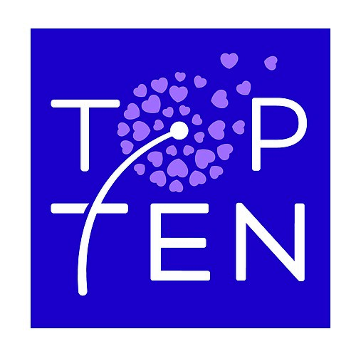  <!-- .element: class="fragment" -->

---

<!--
# Plan

* qui on est
* de quoi qu'on parle, c'est quoi le problème : on s'est rencontré j'étais dev et lui QA
* nos expériences et nos leçons (en vrac, à voir l'ordre ensuite) #top10
  * thales acp : dev en faux-agile, qa en cycle en V, prise en compte du débrayage pour permettre le spy de test : coût marginal pour gain absolu
  * schneider : archi de robot2jira pour intégrer un rapport du pipeline, testable design
  * schneider : procès
  * sncf : test de canva image très très difficile (données non maitrisées), avoir une API pour récupérer ses infos, qui est testée au niveau composant
    * quid de l'example mapping ?
  * schneider proac : heureusement y'a des tests e2e, mais il manque de tests unitaires/integ, donc l'itération est très lente, cf pyramide pas respectée, et boucle de feedback niveau produit cassée par la nightly, et boucle système cassée par release
  * initiative avec Eloise : avoir les moyens en temps, 2 ans plus tard ça s'est perdu
  * quels KPIs on peut proposer ? pas trop de flaky
  * ACCELERATE : opposition vitesse de dev versus stabilité d'ops, les métriques qui s'éuilibrent (et contre la loi de Goodhart)
  * automatisation de test requise pour pouvoir itérer vite, sinon phases de QA trop lentes
  * 10 idées 
  * transformation du rôle de QA dans les équipes Agile (Scrum)
  * turnover et onboarding, garde-fou, apprentissage du métier (voire redécouverte)
  * disposer d'un rapport de maintenance pour le debug, mais aussi pour les tests (shift right), flux du feeback des bugs inverse à celui des features
  * scrum is not enough
  * exemple du besoin de faire tester par des utilisateurs (game jam, ...) cf halway usability test
  * "tests that we dont have time to do"
  * rôle et importance du QA
  * première tache d'onboarding = faire un test, le faire passer en CI (ou la doc d'onboarding)
  * pair testing
-->

<!-- .slide: data-background-image="./daniel-macura-uzDKKDK-A1E-unsplash.jpg" -->

# 1. Code testable et architecture testable

-v-

## Permettre la testabilité

Notes:
* ERIC: Julien et moi nous sommes rencontré sur une mission il y a 3 ans, un projet de micro-services, moi côté dev, lui côté IVVQ (Valid/Verif/QA). On était sur du bon vieux silo : dans mon équipe on essayait de développer des trucs, on lui livrait le bousin, et eux devaient se débrouiller pour réussir à les configurer, lancer, instrumenter, et finalement tester. Si l'on ne prenait en compte que nos spécifications (fonctionnelles), on devait lui livrer quelque chose de sécurisé, sur lequel on ne peut pas se brancher, donc pas vraiment moyen de tester. Besoin de récupérer les logs, de permettre d'intercepter les connexions, ...
* JULIEN: Mais je voyais bien que ce qu'on allait leur livrer serait difficile voire impossible à tester (on avait déjà du mal nous). Je suis donc allé voir Eric, que je ne connaissais pas encore, et on a parlé. Que pouvais-je prendre en compte dans ma conception et mon implémentation pour lui faciliter la vie ?
* JULIEN: Là j'ai du aller parler à un autre être humain pour faire de meilleurs choix, mais souvent c'est avec notre nous du futur qu'il faut discuter des besoins de test, et prévoir dès aujourd'hui le code pour.

-v-

## Ou bien ne pas pouvoir tester

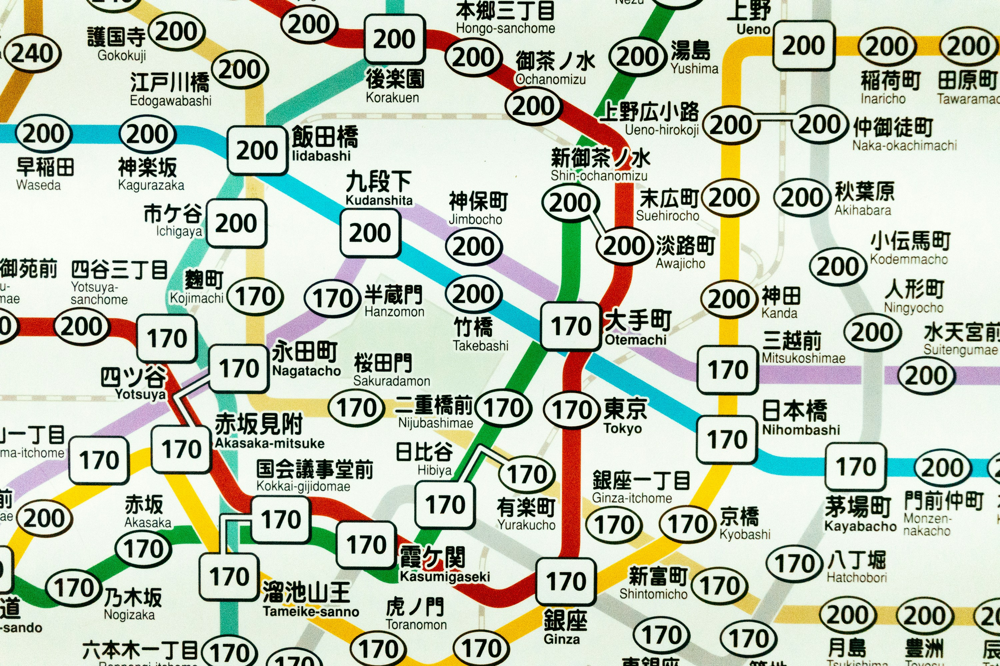

Notes:
* JULIEN : là c'était un exemple de quand ça se passe bien, parce qu'on a pu discuter, prendre en compte les besoins. Quand ça ne l'est pas, on se retrouve parfois au pied du mur. J'ai été sur une mission d'automatisation de test, bien après que l'application ait été developpée. Il y avait des cas de test prévus pour des humains, et qui consistaient à cliquer sur des zones interactives d'une image (un canva). Autant c'était simple humainement de le faire, autant écrire un script équivalent s'est montré bien trop compliqué. Il aurait fallu ajouter des ids de test, des métadonnées, ou un bypass, ... peu importe, mais une façon qui permettait de ne pas avoir à développer un modèle de vision customisé.

-v-

## La testabilité est une feature

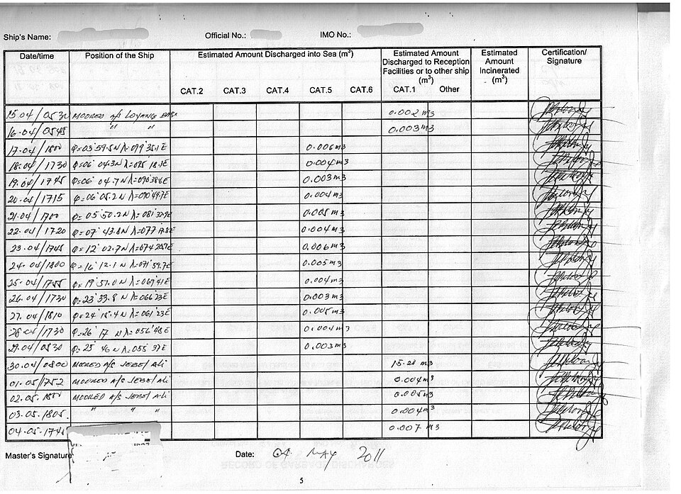

Notes:
* JULIEN: sur une autre mission, j'avais initié une refonte d'une petite application, dont le but principal était de lire et écrire sur une API tierce (qu'on ne controle pas, et qui est lent et peu fiable). Beaucoup de side-effects. Pour faciliter la testabilité, j'aurais pu découpler mon pipeline des interactions avec le serveur. Mais j'aurais été obligé de développer un fake, ce qui aurait posé d'autres problèmes. J'ai donc adapté ma conception : l'intention et le résultat de chaque interaction avec le serveur était consigné dans un journal, qui permettait lors des tests d'identifier efficacement ce qui s'était passé, et ce qui n'était pas normal. Et ça aidait énormément pour dépanner les erreurs en prod ensuite. J'ai pris en compte la testabilité dans le design, ce qui a ouvert la voie à des features différentes.

-v-

## Architecturer la testabilité

Notes:
* JULIEN: une "bonne" archi, pas seulement en termes de testabilité, c'est la bonne adéquation de la solution actuelle aux besoins actuels et futurs. Pour les besoins actuels c'est déjà pas simple, pour les besoins futurs encore moins !
* JULIEN: Mais pour ce qui concerne la testabilité en particulier, je vous recommande en particulier la notion de "seams" de Michael Feathers dans Testing Legacy Software (identifier/créer des coutures/lignes de faille dans nos architectures). On la retrouve sous une autre forme dans Team Topologies.

---

<!-- .slide: data-background-image="./pexels-pixabay-162553.jpg" -->
# 2. Les outils adaptés

-v-

## Du hardware

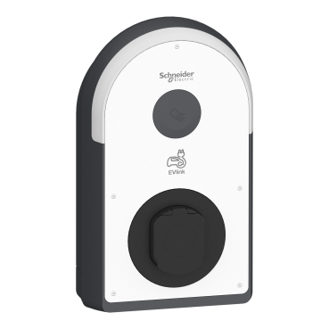

Notes:
* ERIC
  * le DUT / du matériel -> les bornes, tests systèmes, des simus (hardware ou soft)
  * peu de matériel = bottleneck, beaucoup de matériel = multitasking plus efficace

-v-

## Du software

Notes:
* ERIC
  * un outil de gestion -> Jira
  * des moyens d'automatisation -> boardfarm, CI
  * un framework de test -> RobotFramework
* JULIEN: Thales

---
<!-- .slide: data-background-image="./knot-1242654_1280.jpg" -->
# 3. Fiabilité et maintenabilité des tests

-v-

Notes:
* ERIC: 
  * raconter anecdote tests à schneider
  * mettre des efforts pour la maintenance afin d'avoir peu de tests qui échouent pour permettre l'analyse rapide de la non régression
  * historisation de la visu des tests (cc Pinjon) pour trouver les flaky
* JULIEN: ACP : test de micro-services ("le système démarre")

---

<!-- .slide: data-background-image="./Everything-Everywhere-All-at-Once-film-still.png" -->

# 4. Tests everything, everywhere, all at once

-v-

## Le test est un besoin

Notes:
* JULIEN: C'est quand à la toute fin qu'on veut écrire des tests, qu'on se rend compte que ce n'est pas si simple en fait ... Ah, si seulement on y avait pensé plus tôt ! Justement : le test est un besoin au niveau projet. Certes, pas un besoin utilisateur, mais un pré-requis pour pouvoir amener des solutions aux besoins clients.
* JULIEN: le Test devrait être une préoccupation tout du long de la chaîne de production de valeur. De manière similaire au DevOps qui cherche à unifier les préoccupations contradictoires Dev à celles Ops, le TestOps cherche à intégrer le Test tout du long de la chaîne de production de valeur.

-v-

## Tres amigos

Notes:
* Julien: est-ce que vous connaissez les "tres amigos" ? PO, Dev et QA. Autrement dit : besoin client, solution technique, regard qualité et critique sur l'adéquation entre les deux. Car les QA/testeurs/... sont idalement placés à cheval entre les deux mondes, et avec un regard critique sur chacun, pour apporter une vision éclairée sur les discussions.
* JULIEN: je parle d'expérience, même en ayant une sensibilité test et QA pas commune chez les devs, je reste un dev. Quand on me parle problème, j'ai souvent comme premier réflexe de foncer côté solution. Alors qu'un QA n'aura pas ce biais (et même au contraire voudrait bien avoir moins de code à tester !). Dans une mission, autant que possible on embarquait la personne QA de l'équipe, car elle amenait toujours un regard différent de celui PO/BA et Dev. Et les QA sont très bons pour penser en amont aux cas tordus, aux interactions imprévues entre les features, ...

-v-

## Example Mapping

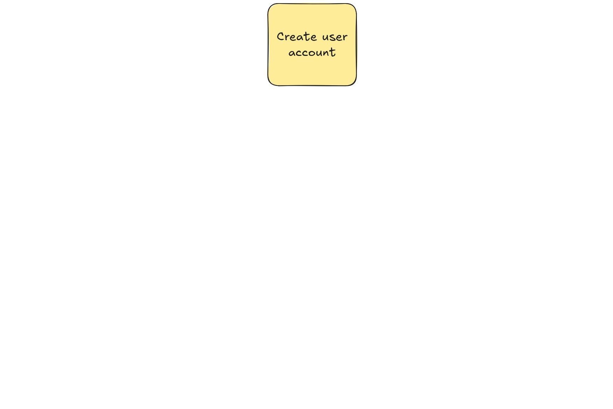  <!-- .element: class="fragment stacked r-stretch" -->
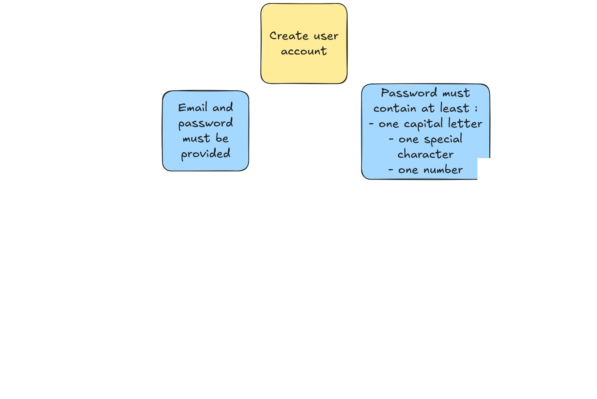  <!-- .element: class="fragment stacked r-stretch" -->
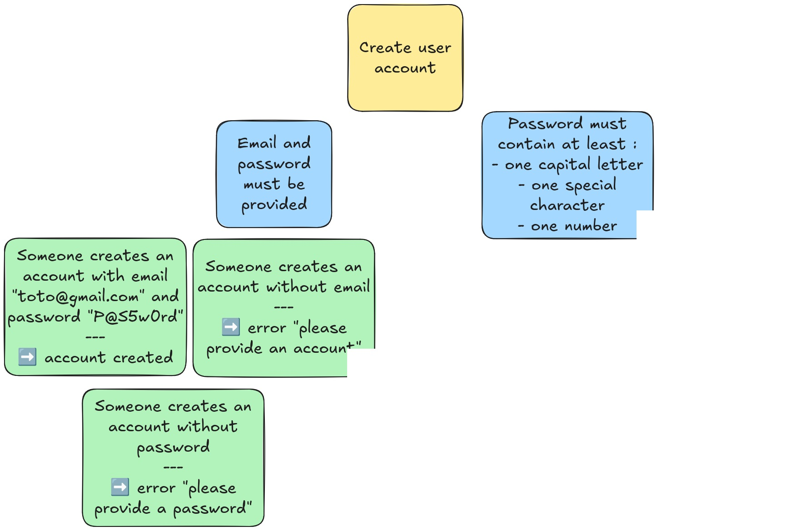  <!-- .element: class="fragment stacked r-stretch" -->
  <!-- .element: class="fragment stacked r-stretch" -->

Notes:
* ERIC:
  * Faire travailler les 3 amigos grace à l'example mapping
  * On travaille sur une feature (jaune)
  * On définit les règles métiers (bleu)
  * On illustre cela par des exemples (vert)
  * PO/Dev/Test posent des questions pour que ça soit clair (rouge)
  * => A la fin, on a des features claires, implémentables et testables

-v-

## Behavior-Driven Development

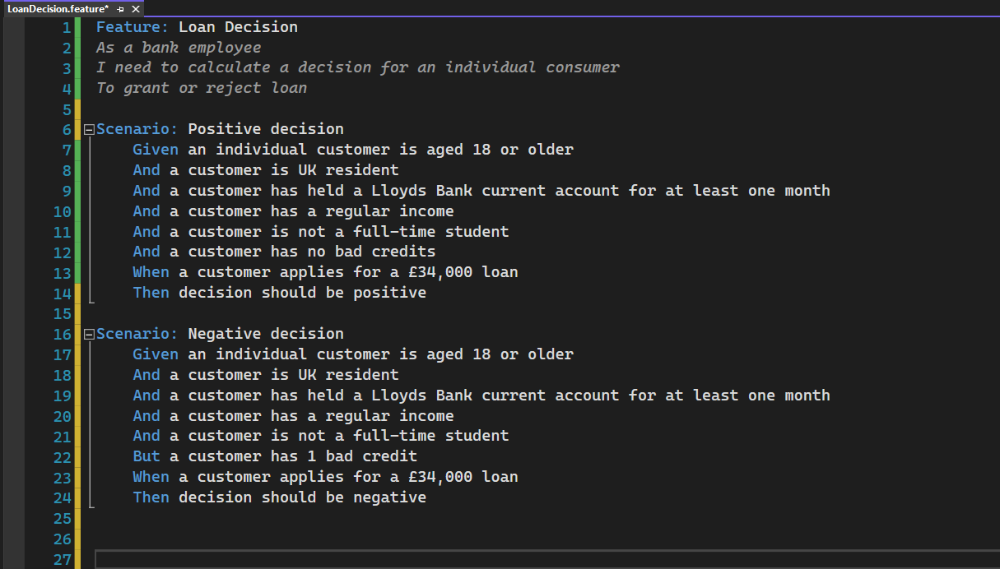  <!-- .element: class="fragment" -->

Notes:
* JULIEN: on peut aussi recourir au BDD. Pas grand chose à voir avec les BDD (bases de données), le TDD ni le DDD, le Behavior-Driven Development consiste à rédiger des cas de test en langage humain et métier (si on considère que les humains parlent le Gherkin), lesquels pourront être exécutés automatiquement par un outil (Cucumber, Gherkin et autres variations sur le thème des concombres et des cornichons).
* JULIEN: Côté avantages, cela permet aux PO/BA de rédiger et comprendre les cas de test, d'avoir une compréhension fine des impacts de "tests qui ne passent pas". Et ce genre de tests est souvent très utile pour comprendre ce que fait l'application. Et robuste aux refactoring (côté rédaction).
* JULIEN: mais il y a des désavantages. Si ce ne sont pas les PO/BA/QA qui rédigent les cas de test, mais les devs, ça peut être très fastidieux comparé à utiliser les frameworks habituels des devs. Et il y a étape de conversion entre le cas de test et son implémentation en code qui peut être messy, au détriment des devs. Une solution intermédiaire c'est de répliquer la verbosité dans le framework des devs, mais ça demande de la rigueur.
* JULIEN: j'ai connu des équipes qui adorent, d'autres qui détestent, donc à voir selon le contexte (comme d'habitude, il n'y a pas de "best practices").
* TODO Julien: https://github.com/ThibautCantet/billetterie/blob/conference/refactoring-with-implementation/src/test/resources/com/billetterie/with-3DS.feature ?

-v-

## Le danger de la Loi de Conway

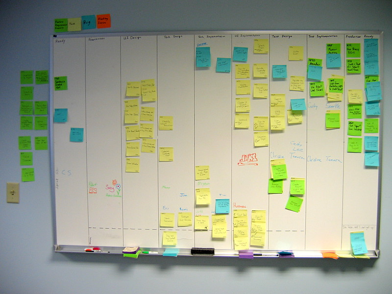

Notes:
* JULIEN: je n'ai pas relu toutes les versions du Guide Scrum, mais il n'y est pas fait mention de Kanban. Et surtout, quelles colonnes mettre dans son Kanban ? Moi j'aime bien TODO/DOING/DONE. Car ça met l'emphase sur ce qui est EN COURS et ce qui est TERMINÉ. Et très simple de mettre une WIP-Limit. Mais souvent on va mettre plein de colonnes, pour décrire toutes les étapes de la production. Effectivement, ça permet de meixu voir le degré d'avancement des tickets. Mais qu'il y ait besoin de granularité dans l'avancement ça suppose que ces tickets sont longs à réaliser (premier red flag pour moi). Et qu'il y ait besoin d'avoir des étapes différentes, c'est souvent le signe que différentes personnes sont requises pour la traversée. Et que la responsabilité est divisée (donc personne n'est responsabla, aka chat perché). Et donc on découpe en fonction des personnes, on crée des silos. Pour moi, c'est un anti-pattern, qu'il faut combattre.
* JULIEN: la Loi de Conway, c'est que "les organisations qui designent des systèmes sont forcées de produire des designs qui sont des copies des structures de communication de ces organisations". Autrement dit, si j'ai une équipe Frontend, une équipe Backend, et une équipe Base de Données, qu'importe le besoin, la solution aura la forme Frontend/Backend/Base de données. Ce qui est un énorme biais. Il faut donc penser les structures d'une organisation pour influer positivement sur les systèmes. D'où les "feature teams" : une équipe pluri-disciplinaire, indivisible, en charge de la réalisation bout-en-bout des solutions aux besoins métiers. On dirait la définition du Scrum Guide ! On ne devrait pas chercher à créer des verticales dans un kanban, mais des horizontales.

-v-

## Avoir les moyens de ses ambitions

Notes:
* JULIEN: "pas de bras, pas de chocolat". C'est pareil avec les tests ! Si on n'a pas le temps de s'y consacrer, pas les outils adaptés, pas la formation, pas la reconnaissance, ... bah ça ne va pas marcher. Il faut réunir les bonnes conditions pour réussir.
* JULIEN: ça peut passer par se mettre d'accord en tant qu'équipe sur l'importance d'investir dans l'automatisation, et l'inscrire dans le Definition of Done. D'instaurer les "tres amigos" pour que les tests ne soient jamais oubliés. Peu importe : il faut manifester une volonté, réunir les moyens, et s'engager.

---

<!-- .slide: data-background-image="./OVH-en-flammes.jpg" -->

# 5. Maitriser les défauts envoyés en production

-v-

## Accepter de faire des erreurs

Notes:
* JULIEN: on ne peut pas garantir le zéro défaut (à coût raisonnable pour la grande majorité des projets), donc il faut accepter qu'il y aura des erreurs en prod. Ce n'est pas du fatalisme mais du pragmatisme. Et donc au lieu de fataliser "tant pis !", on peut pragmatiquement surveiller l'état de la production, pour être notifié des erreurs DÉTECTABLES. Couplé éventuellement à de l'alerting, ça permet de repérer les erreurs, voire de les corriger avant même que les utilisateurs aient le temps de s'en plaindre. Quand l'utilisateur reçoit un mail pour l'informer que le problème qu'il est en train de rencontrer vient d'être résolu, ça fait un super effet !
* JULIEN: et y'a aussi le facteur psychologique pour l'équipe : ça donne un peu de concret, de visuel, et de proximité à une "production" qui peut être un peu trop abstraite. Ca donne envie d'en prendre soin (ownership, DevOps), et d'être rassuré qu'elle semble bien fonctionner.

-v-

## Optimiser la collecte d'informations

<!--  -->
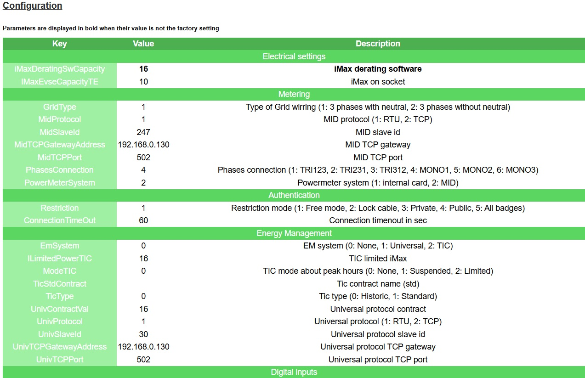

Notes:
* ERIC: rapport de maintenance: 
  * utile pour récupérer logs, base de donneés, configuration et aider dans le débugage 
  * aide le développeur pour débugguer, le testeur pour reproduire un bug, le support pour dépanner le client
* la débuggabilité est une feature

---

<!-- .slide: data-background-image="./jp-valery-lVFoIi3SJq8-unsplash.jpg" -->

# 6. Investir dans les tests autos

Notes:
* JULIEN: comme beaucoup de choses, c'est une question d'argent. Effectivement, implémenter et maintenir des tests autos ça coûte de l'argent. Mais ne pas les implémenter ou les maintenir, c'est faire le choix soit de payer du test manuel fréquent et large, soit de prendre le risque de ne pas tester.
* JULIEN: D'ailleurs, j'ai uen anecdote sur le lien entre le test et le pognon. Sur l'une de mes missions, mon client vendait son produit sur la base de features qui n'avaient pas été testées à l'échelle. Un gros client, le premier à faire des déploiements à l'échelle, a constaté des dysfonctionnements, et a envoyé des menaces de procès. En le client réalise alors le risque que cela n'avait pas été testé, d'une part par manque d'investissement, mais surtout par manque de matériel pour faire des déploiements à l'échelle. En deux semaines, il pleuvait du matériel, et réaliser ces tests était devenu une urgence. Comme quoi, le risque de perdre des millions justifiait enfin de dépenser quelques centaines de milliers d'euros.

-v-

## Scaling

Notes:
* JULIEN: 8ème principe du Manifeste Agile :
* JULIEN: Les processus agiles encouragent à respecter un rythme soutenable lors de la réalisation. Les commanditaires, les réalisateurs et les utilisateurs devraient pouvoir maintenir indéfiniment un rythme constant.
* JULIEN: or on vit dans un monde qui accélère, ou du moins qui tente d'accélérer, il y a donc besoin de scaler : livrer plus rapidement, plus fréquemment, plus fiablement, avec plus de personnes, avec moins de personnes, avec de nouvelles technos, ... Tout ça est facilité, si ce n'est permis par les tests autos. Les tests manuels sont un véritable frein à toute démarche d'accélération. On ne dit pas "mort au test manuel", il a sa place dans une stratégie, mais il n'est pas un pilier essentiel.
* JULIEN: une suite de test rapide, fiable et maintenable, c'est un allié inestimable lors de la vie du projet, et une bonne garantie que le projet peut perdurer.

-v-

## Risque

Notes:
* JULIEN: l'absence de test autos est une pente glissante : plus longtemps on attend, moins ils seront utiles, et plus ils couteront à mettre en place (car le projet ne les aura pas prévus), donc leur rentabilité s'effondre. Et on finit sur un projet qu'on oblige les devs à tester manuellement, laborieusement et à répétition. Non non, j'ai pas posé une démission pour ce motif il y a quelques mois.

-v-

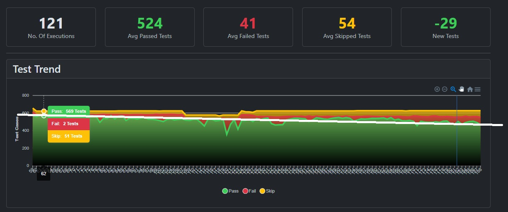

Notes:
* ERIC: 
  * si on n'a pas de temps pour réparer au fur et à mesure ça se dégrade
  * faire des rappels réguliers (en review, daily) que c'est important d'investir du temps

---

<!-- .slide: data-background-image="./osama-elsayed-vqRMXgVtGXM-unsplash.jpg" -->

# 7. Les niveaux de test

-v-

## Pyramide ?

Notes:
* ERIC: ex mauvaise répartition à cause de l'architecture du projet = trop de tests end-to-end sur hardware => perte de performance (un test = 5 min d'exec au lieu de 30s)
* JULIEN: Un bel exemple de pyramide ratée. Pour ma part, pour reprendre l'exemple de l'appli microservices sur lequel je travaillais, l'un deux était extrêmement complexe et critique, et donc avait le droit à des tests unitaires et de performance ciblés. Mais la plupart des autres faisaient du passe-plat, et donc était sommairement testés au niveau du composant. J'ai préféré mettre l'effort au niveau de l'intégration de tous les micro-services et de leur environnement, pour valider des scénarios métier de bout-en-bout. Et on essayait de faire quelques tests sur le prototype hardware, mais principalement du cas nominal. On n'était donc pas sur une pyramide, mais plutôt sur un magnum. C'est ce qui nous semblait le mieux adresser nos besoins et risques.
* JULIEN: il ne faut pas suivre aveuglément la règle de faire des pyramides de test (comme il ne faut suivre aucune règle aveuglément). La pyramide c'est la forme décidée par la stratégie de test, qui se base sur les particularités du projet et de l'équipe qui le développe, à un moment donné. Donc il n'y en a pas deux pareilles, ça dépend. Et une bonne pyramide donne du bon feedback, permet un développement rapide.
* transition vélocité/feedback

---

<!-- .slide: data-background-image="./pexels-stywo-1110494.jpg" -->
# 8. Confiance d'aller vite

-v-

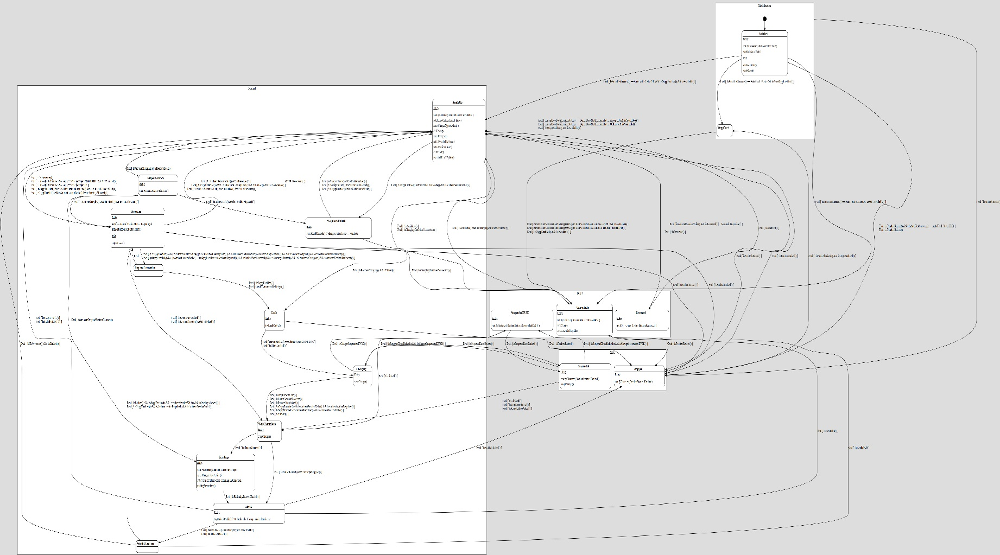

Notes:
* ERIC: 
  * développement de l'iso est plus rapide grace au nightly + confiance d'avancer (même si on connait pas tout le produit, on a un garde fou eg: timeout iec)
  * si les features sont de plus en plus lentes ou difficiles à produire, ça casse l'itérativité
* JULIEN: rapide à écrire, à lancer
* JULIEN: robot2jira: end-to-end 2 minutes

---

<!-- .slide: data-background-image="./road-trip-with-raj-o4c2zoVhjSw-unsplash.jpg" -->

# 9. Apprendre

-v-

## Agilité

Notes:
* ERIC: apprendre = la base de l'agilité (3ème mot du manifeste : "uncovering")
    * en rétro, décider de re-prioriser les tests ou la CI
    * anecdote: apprentissage de l'importance des tests à l'équipe, maintenant c'est eux qui font les remarques d'eux même

-v-

## DORA : Apprendre à apprendre

Notes:
* JULIEN: j'ai découvert il y a quelques années Accelerate, le livre édité par le DevOps Research and Assessment group (DORA). Bien qu'il se concentre sur le DevOps, il répondait à beaucoup de limitations que je vois dans le Manifeste Agile : quelles sont les bonnes pratiques ? Comment convaincre de l'utilité de les mettre en place ?
* JULIEN: Depuis, DORA a été intégré à Google, et propose non pas un framework mais un ensemble de Metrics de performance et de Capabilites. Les tests et leur automatisation sont alors largement recommandés. Et les KPI proposés sont vraiment bien je trouve.
* JULIEN: Une bonne partie de notre discours dans ce talk, ça s'inscrit dans la "culture organisationnelle générative (au sens du Dr. Ron Westrum)", à l'inverse de cultures bureaucratiques ou pathologiques.
* JULIEN: D'expérience, le DevOps c'est archi-important, j'en ai fait ma spécialisation. Et sur tous les projets où je suis passé, j'ai essayé de mettre en place ce qui pouvait l'être : un environnement local efficace, une CI de confiance, une prod domptée.

---

<!-- .slide: data-background-image="./glenn-villas-Z5jO59eYuqM-unsplash.jpg" -->

# 10. Retour sur investissement ?

Notes:
* ERIC: investissement constant requis, impression de ne pas dev
* transition "des fois on a l'impression que ça ne sert à rien, des fois c'est vraiment le cas"

-v-

## Difficile de tester

Notes:
* ERIC: tests de cybersécurité, encore principalement manuels (audits, pentesters, analyse des remontées), l'outillage auto commence à apparaître, et l'IA émerge
* JULIEN: Encore aujourd'hui il n'est pas fréquent ni toujours simple de tester l'ergonomie. Grâce au RGAA, des outils plutôt faciles à utiliser et efficace sont disponibles pour tester l'accessibilité web. Mais en-dehors du Web, ou pour l'UX en géénral, ça reste aujourd'hui compliqué de tester (il faut une personne UX, des utilisateurs, et beaucoup de temps).

-v-

## Tant pis

Notes:
* ERIC: 
  * projet web dev, 6 mois en école : coût d'apprentissage, de mise en place, code jetable ou POC = faire des tests manuels
  * puis automatisation après lorsqu'on se rend compte qu'on veut le maintenir sur la durée
* TODO JULIEN: du code legacy difficile à tester en auto, beaucoup de retard, besoin urgent de mettre en prod : pas le choix, on va tester manuellement un peu, et croiser les doigts (et serrer les fesses)

-v-

## Ou choisir de rester manuel

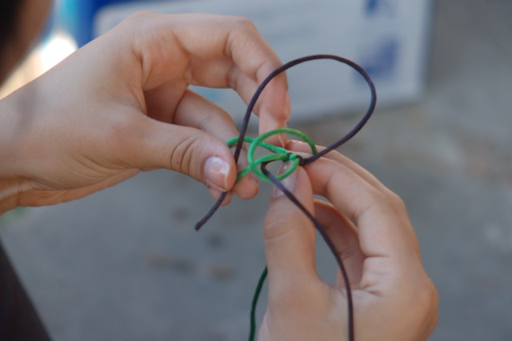

Notes:
* ERIC: monkey testing, test manuel exploratoire

---

<!-- .slide: data-background-image="./markus-spiske-j2s9TffBQLk-unsplash.jpg" -->

# Conclusion

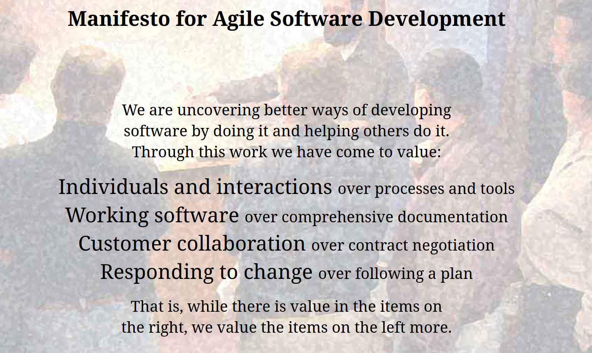  <!-- .element: class="fragment stacked r-stretch" -->
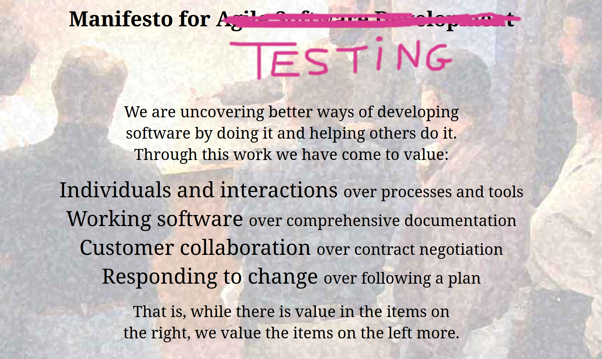  <!-- .element: class="fragment stacked r-stretch" -->
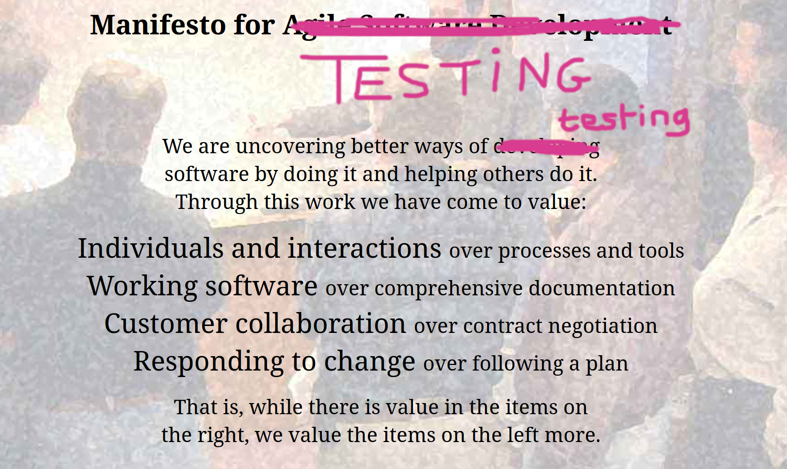  <!-- .element: class="fragment stacked r-stretch" -->
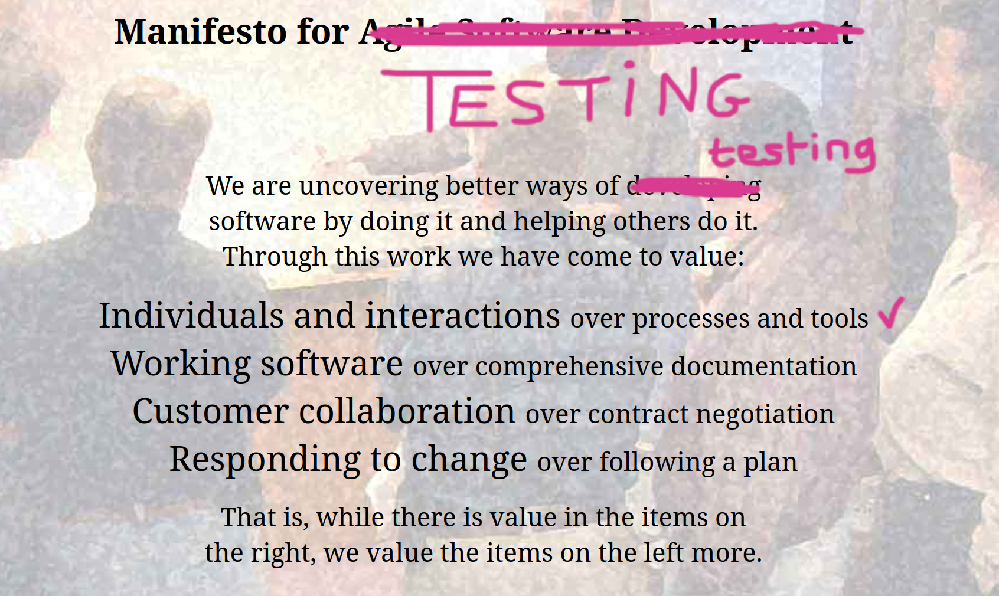  <!-- .element: class="fragment stacked r-stretch" -->
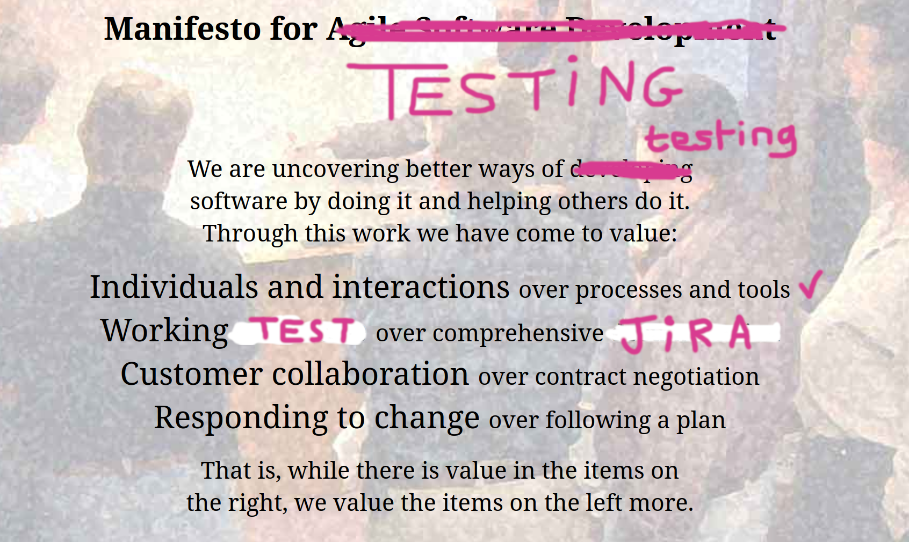  <!-- .element: class="fragment stacked r-stretch" -->
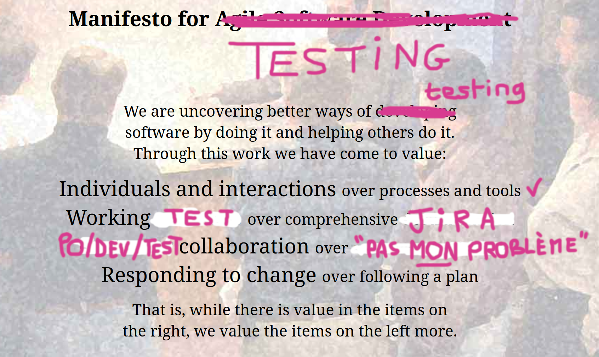  <!-- .element: class="fragment stacked r-stretch" -->
  <!-- .element: class="fragment stacked r-stretch" -->

Notes:
* le test, grand oublié tout court
* rendre le test "agile" (appliquer l'agilité au test et au testeur), donc gagner en qualité et rapidité
  * abstract
* reprendre le manifeste agile, et remplacer le mot "dev" par "test"
    * Individuals and interactions over processes and tools
    * Working TEST over comprehensive JIRA
    * Dev-Test collaboration over "c'est pas mon problème"
    * Responding to change over following a TEST plan
* le test comme moteur de la boucle de feedback : les tests agiles sont les tests autos, au lieu de les faire après on les fait en même temps, on itère
* TODO JULIEN: refaire une version plus belle, et cette fois-ci ne pas écraser le "agile" du titre
* NOUS2: énoncer en alterné

---

<!-- .slide: data-background-image="./annie-spratt-0ZPSX_mQ3xI-unsplash.jpg" -->

# Pour aller + loin

* [DORA Core Model - Get better at getting better](https://dora.dev/research/?view=detail)
* [[Livre] Team Topologies - Organizing for fast flow of value](https://teamtopologies.com/)
* [Livre] Michael feathers - Working effectively with legacy code
* [[Talk] Arnaud Langlade - Example Mapping](https://www.youtube.com/watch?v=0Qlx7q1-GZA)
* [[Podcast] If This Then Dev #327 - Fiabiliser l'usine logicielle, avec Geoffrey Berard](https://www.ifttd.io/episodes/fiabiliser-l-usine-logicielle) + sa version compilée "#327.exe" avec Louis Pinsard
* [[Podcast] Developer Experience Opionated #3 - Comment penser les tests logiciels en 2025, avec Antoine Craske](https://podcast.ausha.co/developer-experience/antoine-craske)
* [[Podcast] QG Qualité - Le QE Score chez Carrefour, avec Simon Champenois](https://www.ssid.fr/qe-score/)
* l'IA pour le test

---

<!-- .slide: data-background-image="./annie-spratt-0ZPSX_mQ3xI-unsplash.jpg" -->

# Crédits photos

<!-- first slide -->
* Photo of a rusty car by <a href="https://unsplash.com/@meteorphoto">Peter Pryharski</a> on <a href="https://unsplash.com/photos/wrecked-white-volkswagen-beetle-coupe-on-grass-8zJSg57TBBA">Unsplash</a> (<a href="https://unsplash.com/license">Free licence</a>)
<!-- intro -->
* ["Official logo for the Top Ten Professional Women and Leading Business Awards event" by Marjaree Mason Center on Wikimedia Commons (CC-BY-SA 4.0)](https://commons.wikimedia.org/wiki/File:Top_Ten_Logo.jpg)
<!-- 1. Code-archi testable -->
* Photo of a castle by <a href="https://unsplash.com/@daniel_macura">Daniel Mačura</a> on <a href="https://unsplash.com/photos/brown-concrete-castle-on-top-of-mountain-uzDKKDK-A1E">Unsplash</a> (<a href="https://unsplash.com/license">Free licence</a>)
* Image of an abstract mechanism by <a href="https://unsplash.com/@growtika">Growtika</a> on <a href="https://unsplash.com/photos/a-group-of-blue-and-white-drones-UyvnmroVRW4">Unsplash</a> (<a href="https://unsplash.com/license">Free licence</a>)
* Photo of a train map by <a href="https://unsplash.com/@jac_kie_co">Jackie Alexander</a> on <a href="https://unsplash.com/photos/a-subway-map-with-a-lot-of-asian-characters-on-it-f12UaTBVtC0">Unsplash</a> (<a href="https://unsplash.com/license">Free licence</a>)
* Photo of a road by <a href="https://unsplash.com/@jerrykavan">Jerry Kavan</a> on <a href="https://unsplash.com/photos/aerial-view-of-asphalt-road-surrounded-by-trees-vv-oEGlN-4E">Unsplash</a> (<a href="https://unsplash.com/license">Free licence</a>)
* ["Garbage Record Book, as required by MARPOL" by Ciacho5 on Wikimedia Commons (CC-BY-SA 3.0)](https://commons.wikimedia.org/wiki/File:Garbage_log.jpeg)
* Photo of a cracked rock by <a href="https://unsplash.com/@braxted">Chris J Walker</a> on <a href="https://unsplash.com/photos/a-rock-with-a-crack-in-the-middle-of-it-CaleudV9jII">Unsplash</a> (<a href="https://unsplash.com/license">Free licence</a>)
* Photo of textile seam by <a href="https://unsplash.com/@enginakyurt">engin akyurt</a> on <a href="https://unsplash.com/photos/blue-denim-textile-with-white-button-M-NPViXH_do">Unsplash</a> (<a href="https://unsplash.com/license">Free licence</a>)
<!-- 2. outils -->
<!-- 3. fiabilité -->
<!-- 4. test en amont -->
* Image du film "Everything, Everywhere, All at Once" ([via Vanity Fair](https://www.vanityfair.com/hollywood/2022/04/everything-everywhere-all-at-once-movie-review))
* Photo of a facepalm by <a href="https://unsplash.com/@silverkblack">Vitaly Gariev</a> on <a href="https://unsplash.com/photos/man-rubbing-his-face-in-front-of-laptop-bl7h_R-PKpU">Unsplash</a> (<a href="https://unsplash.com/license">Free licence</a>)
* Photo of 3 cats by <a href="https://unsplash.com/@theluckyneko">The Lucky Neko</a> on <a href="https://unsplash.com/photos/three-brown-tabby-kitten-lying-on-board-uePn9YCTCY0">Unsplash</a> (<a href="https://unsplash.com/license">Free licence</a>)
* Image d'un Example Mapping, par Julien Lenormand, basé sur l'[exemple d'Arnaud Langlade](https://www.youtube.com/watch?v=0Qlx7q1-GZA)
* Screenshot de code de Behavior-Driven Development, par [Dominik Szahidewicz](https://bugbug.io/blog/software-testing/8-steps-to-use-behavior-driven-development/)
* [Photo of a Kanban board by Chris Huffman on Flickr (CC-BY-NC-ND 2.0)](https://www.flickr.com/photos/chrishuffman/2336990347)
* Image du film "Intouchables" ([via TF1](https://x.com/TF1/status/541692601976782849))
<!-- 5. test en aval -->
* Photo de l'incendie du datacenter d'OVH (Copyright SAPEURS-POMPIERS DU BAS-RHIN)
* Photo of monitoring by <a href="https://unsplash.com/@lukechesser">Luke Chesser</a> on <a href="https://unsplash.com/photos/graphs-of-performance-analytics-on-a-laptop-screen-JKUTrJ4vK00">Unsplash</a> (<a href="https://unsplash.com/license">Free licence</a>)
* Photo of repairing by <a href="https://unsplash.com/@thisisengineering">ThisisEngineering</a> on <a href="https://unsplash.com/photos/person-holding-green-and-black-circuit-board-32PpagSzeGs">Unsplash</a> (<a href="https://unsplash.com/license">Free licence</a>)
<!-- 6. investir -->
* Photo of dollars by <a href="https://unsplash.com/@jpvalery">Jp Valery</a> on <a href="https://unsplash.com/photos/100-us-dollar-banknote-lVFoIi3SJq8">Unsplash</a> (<a href="https://unsplash.com/license">Free licence</a>)
* Photo of spiraling staircase by <a href="https://unsplash.com/@tine999">Tine Ivanič</a> on <a href="https://unsplash.com/photos/spiral-concrete-staircase-u2d0BPZFXOY">Unsplash</a> (<a href="https://unsplash.com/license">Free licence</a>)
* Photo of boardgame "Serpents and Ladders" by <a href="https://unsplash.com/@vdphotography">VD Photography</a> on <a href="https://unsplash.com/photos/a-close-up-of-a-board-game-with-dices-6EEBGlCVOnw">Unsplash</a> (<a href="https://unsplash.com/license">Free licence</a>)
<!-- 7. niveaux de test -->
* Photo of pyramids by <a href="https://unsplash.com/@osamaabosaadia">Osama Elsayed</a> on <a href="https://unsplash.com/photos/brown-pyramid-under-blue-sky-during-daytime-vqRMXgVtGXM">Unsplash</a> (<a href="https://unsplash.com/license">Free licence</a>)
* Photo of inverted pyramid by <a href="https://unsplash.com/@sherlocke">Helen Browne</a> on <a href="https://unsplash.com/photos/modernist-building-with-a-unique-inverted-pyramid-design-0cw5y0iW490">Unsplash</a> (<a href="https://unsplash.com/license">Free licence</a>)
<!-- 8. feedback -->
<!-- 9. DORA -->
* Photo of Spider-man reading by <a href="https://unsplash.com/@roadtripwithraj">Road Trip with Raj</a> on <a href="https://unsplash.com/photos/spider-man-leaning-on-concrete-brick-while-reading-book-o4c2zoVhjSw">Unsplash</a> (<a href="https://unsplash.com/license">Free licence</a>)
* ["Dora the Explorer" by Håkan Dahlström on Wikimedia Commons (CC-BY 2.0)](https://commons.wikimedia.org/wiki/File:Dora_the_Explorer_(4844562834).jpg)
<!-- 10. ROI -->
* Photo of a "stop sign" by <a href="https://unsplash.com/@glennvillas">Glenn Villas</a> on <a href="https://unsplash.com/photos/a-red-off-limit-sign-hanging-from-a-rope-Z5jO59eYuqM">Unsplash</a> (<a href="https://unsplash.com/license">Free licence</a>)
* Photo of a Jenga tower by <a href="https://unsplash.com/@mparzuchowski">Michał Parzuchowski</a> on <a href="https://unsplash.com/photos/boy-playing-jenga-geNNFqfvw48">Unsplash</a> (<a href="https://unsplash.com/license">Free licence</a>)
* Photo by <a href="https://unsplash.com/@steve_donoghue">Steve Donoghue</a> on <a href="https://unsplash.com/photos/man-riding-personal-watercraft-ynRImHi8LnY">Unsplash</a> (<a href="https://unsplash.com/license">Free licence</a>)
* Photo of a scoubidou by <a href="https://unsplash.com/@tbk_10101">elia salibi</a> on <a href="https://unsplash.com/photos/a-person-holding-a-pair-of-glasses-X_dVxQf6Y2Q">Unsplash</a> (<a href="https://unsplash.com/license">Free licence</a>)
<!-- Conclusion -->
* Photo of "end" word by <a href="https://unsplash.com/@markusspiske">Markus Spiske</a> on <a href="https://unsplash.com/photos/text-j2s9TffBQLk">Unsplash</a> (<a href="https://unsplash.com/license">Free licence</a>)
* Photo of a painting by <a href="https://unsplash.com/@anniespratt">Annie Spratt</a> on <a href="https://unsplash.com/photos/an-abstract-painting-with-orange-and-blue-colors-0ZPSX_mQ3xI">Unsplash</a> (<a href="https://unsplash.com/license">Free licence</a>)
<!-- cute bonus -->
* Photo of a rabbit by [Степана](https://unsplash.com/@sgalagaev>Ансплэш) on [Unsplash](https://unsplash.com/photos/brown-rabbit-on-window-during-daytime--5iSCtrJX5o) (<a href="https://unsplash.com/license">Free licence</a>)

-v-

* TODO JULIEN: split on several pages

---

<!-- .slide: data-background-image="./annie-spratt-0ZPSX_mQ3xI-unsplash.jpg" -->

# Questions

Slides

[https://github.com/Lenormju/talk-test-auto-agile/](https://github.com/Lenormju/talk-test-auto-agile/)

OpenFeedback

[https://app.roti.express/r/ag2025-13](https://app.roti.express/r/ag2025-13)

Notes:

---

<!-- .slide: data-background-image="./annie-spratt-0ZPSX_mQ3xI-unsplash.jpg" -->

# Rappels des 10 points

1. Code testable et architecture testable
2. TODO JULIEN outils adaptés
3. TODO JULIEN test fiable
4. Test everything, everywhere
5. Maîtriser les défauts envoyés en prod
6. Investir dans les tests autos
7. Les niveaux de test
8. TODO JULIEN Avoir confiance d'aller vite
9. Apprendre
10. Estimer le ROI

---

<!-- .slide: data-background-image="./sgalagaev--5iSCtrJX5o-unsplash.jpg" -->

# Un lapin !

---

<!-- .slide: data-background-image="./annie-spratt-0ZPSX_mQ3xI-unsplash.jpg" -->

# Abstract

Il est assez facile de voir comment l'Agilité permet d'aller vite, mais la Qualité ne découle pas aussi clairement de ses Valeurs ("Des logiciels opérationnels plus qu’une documentation exhaustive") et ses Principes ("Un logiciel opérationnel est la principale mesure d’avancement").
On pensait en avoir fini avec le cycle en V, mais est-ce que garder le test comme une étape successive du dev n'est pas perpétuer les mêmes causes d'un même échec ?

On voudrait vous présenter une vision différente du Test, et surtout de comment l'intégrer à nos processus Agiles :
* l'intégrer très en amont (#ShiftLeftTesting), par exemple dès le raffinement du besoin (#ExampleMapping et #BDD) ou lors de la phase de conception (#TestableDesign),
* anticiper les besoins techniques (#TestOps),
* éviter les défauts (#RightTheFirstTime et #Lean).

Venez découvrir (au-delà des #buzzwords) d'autres approches du test, en partant de cas réels, et en cherchant toujours comment, concrétement, assurer un bon niveau de qualité sur nos projets.
